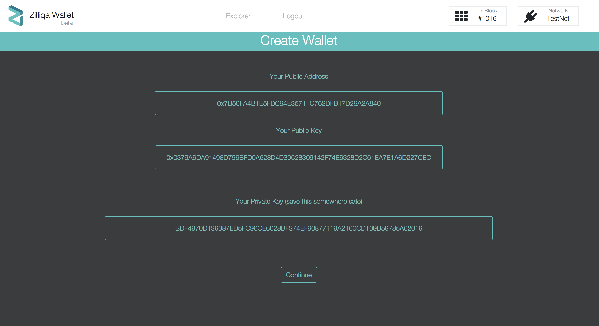
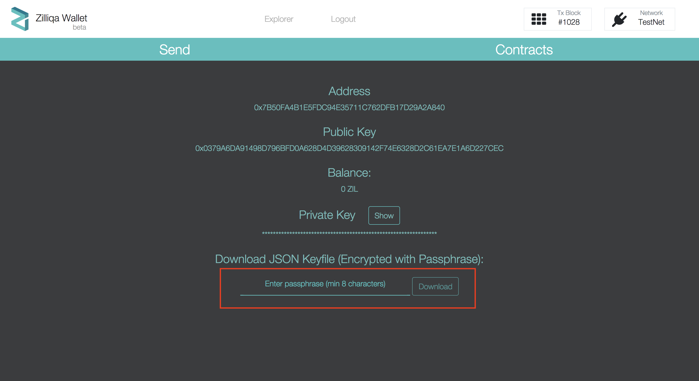
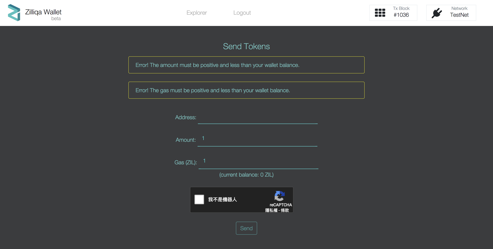

> 📖🔍 Documents of the Zilliqa Name Service.

## 💡 What is Zilliqa?
Zilliqa is the world's first high-throughput public blockchain platform - designed to scale to thousands ​of transactions per second.

## 💡 What is BNS?
BNS – or blockchain name system – is the protocol on the internet that turns human-comprehensible decentralized website names such as ‘website.perl’ or ‘mywebsite.eth’ into addresses understandable by decentralized network machines.

## 📝 Description
ZNS is the Zilliqa Name Service, a distributed, open, and extensible naming system based on the Zilliqa blockchain.

## 📚 Documents

#### Table of Contents
-  [Introduction](./docs/INTRODUCTION.md)
-  [Implementation](./docs/IMPLEMENTATION.md)
    - [Registry](./docs/REGISTRY.md)
    - [Registrar](./docs/REGISTRAR.md)
    - [Resolver](./docs/RESOLVER.md)
-  [Integration](./docs/INTEGRATION.md)
- [Introduction](./docs/INTRODUCTION.md)

## ⌨️ Smart Contract Language

  

- [Scilla Document](https://scilla.readthedocs.io/en/latest/)

## Introduction

### Network Sharding
Zilliqa dynamically splits the network of blockchain nodes into different subgroups, called shards, with each shard formed to process and reach consensus on a subset of transactions. This way, disjoint subsets of transactions can be processed in parallel, and significantly boost the transaction throughput by orders of magnitude. Eventually, such transactions are merged into a new block that is committed to the blockchain.

Dividing the mining network into smaller shards is a two-step process. First, a dedicated set of nodes called the directory service committee (or DS committee) are elected which then shard the network and assign nodes to their shard. The directory service committee is tasked to coordinate the sharding process, as well as validate the blocks of transactions proposed by each shard and verify if they have received approval from a sufficiently large quorum within the shard.

### Secure & Efficient Consensus Algorithm
Within the directory service committee and each shard that processes and accepts transactions, Zilliqa runs a secure and efficient consensus protocol. The protocol enables each shard to reach an agreement on the blocks to propose. The consensus protocol is based on the idea of byzantine fault tolerance (BFT) with heavy optimizations of improving its efficiency by using the idea of employing EC-Schnorr multisignature in the PBFT protocol as developed in CoSi.

### Transaction Sharding
For better scalability, Zilliqa makes two conscious choices in the design of transaction sharding:

1. Zilliqa provides atomic transaction commits without involving cross-shard communication that is often costly and complex.

2. Zilliqa allows transactions to be processed asynchronously with the consensus processes of the blockchain. Zilliqa adopts a “reject-and-retry” mechanism to asynchronously process transactions as and when the majority of nodes become up-to-date.

### Computational Sharding & Sharding-Friendly Smart Contract Language
With scalability as the main goal of Zilliqa, it proposes a new smart contract language Scilla that scales much better for a multitude of applications that range from automated auctions, shared economy to financial modelling. Beyond verifiability of security and correctness properties, Zilliqa’s smart contract language will run efficiently on a blockchain architecture with sharding. Moreover, it will enable sharding of computational resources in the blockchain network via an overlay above the consensus process, i.e., computational sharding. Computational sharding allows users of Zilliqa and applications running on Zilliqa to specify the sizes of consensus groups to compute for each of the subtasks. Each consensus group will then be tasked to compute the same subtask, and produce the results. The user specifies the condition on acceptance of the results, e.g., all in the consensus group must produce the same results, or 3/4 of them must produce the same results, etc.

## Zilliqa Wallet

[Wallet](https://wallet-scilla.zilliqa.com/home) that is connected to a wallet and Zilliqa testnet.

### How to create wallet

1. Access [Wallet](https://wallet-scilla.zilliqa.com/create) and click `Create New Wallet` -> `Click to Generate Address`. And you will see the newly created wallet:

  Remember to back up the private Key!

2. And click `continue` to download JSON keyfile that encrypted with passphrase:

3. Now you can send the transaction on Wallet IDE:

## 📣 Contributing
See [CONTRIBUTING.md](./CONTRIBUTING.md) for how to help out.

## 🗒 Licence
See [LICENSE](./LICENSE) for details.
