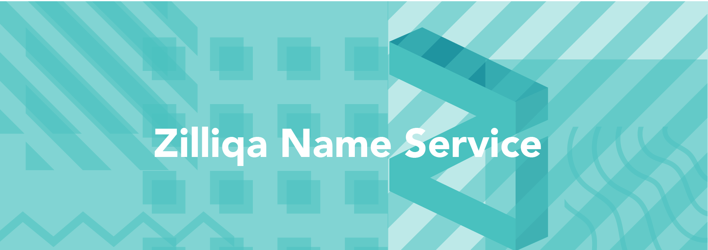

> 📖🔍 Documents of the Zilliqa Name Service.

## 💡 What is Zilliqa?
Zilliqa is the world's first high-throughput public blockchain platform - designed to scale to thousands ​of transactions per second.

## 💡 What is BNS?
BNS – or blockchain name system – is the protocol on the internet that turns human-comprehensible decentralized website names such as ‘website.perl’ or ‘mywebsite.eth’ into addresses understandable by decentralized network machines.

## 📝 Description
ZNS is the Zilliqa Name Service, a distributed, open, and extensible naming system based on the Zilliqa blockchain.

## 📚 Documents

#### Table of Contents
- [Introduction](./docs/INTRODUCTION.md)

## ⌨️ Smart Contract Language
- [Scilla](https://scilla-lang.org/)

## 📣 Contributing
See [CONTRIBUTING.md](./CONTRIBUTING.md) for how to help out.

## 🗒 Licence
See [LICENSE](./LICENSE) for details.
