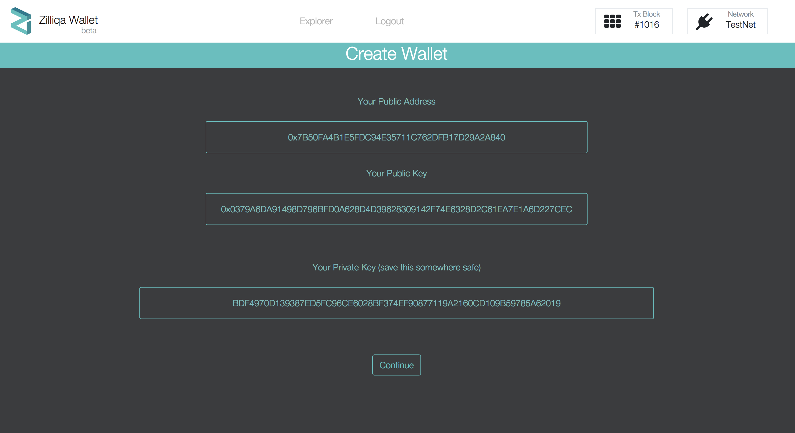
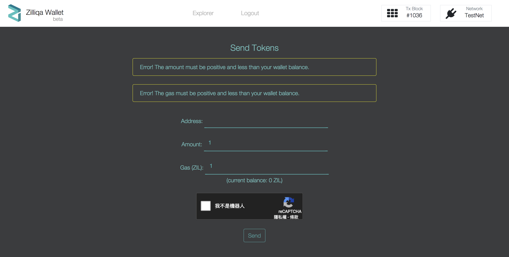

# Wallet IDE

[Wallet IDE](https://wallet-scilla.zilliqa.com/home) that is connected to a wallet and Zilliqa testnet.

# How to create wallet

1. Access [Wallet IDE](https://wallet-scilla.zilliqa.com/create) and click `Create New Wallet` -> `Click to Generate Address`. And you will see the newly created wallet:

  Remember to back up the private Key!

2. And click `continue` to download JSON keyfile that encrypted with passphrase:

3. Now you can send the transaction on Wallet IDE:

