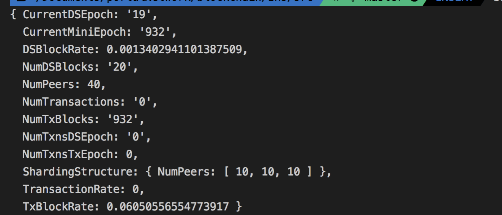

# Zilliqa-JavaScript-Library

Through Zilliqa provided library and node, we can interact with its testnet.

## Installation

### Yarn
`yarn add zilliqa-js`

### NPM
`npm install zilliqa-js`

## Usage example

```js
import { Zilliqa } from 'zilliqa-js';

//To connect to the external network, use URL = 'https://api-scilla.zilliqa.com'
const URL = 'https://api-scilla.zilliqa.com';
const zilliqa = new Zilliqa({
    nodeUrl: URL
});
const callback = (err, data) => {
	if (err || data.error) {
		console.log('Error')
	} else {
		console.log(data.result)
	}
};

let node = zilliqa.getNode();


node.isConnected((err, data) => {
		if(!err){
			node.getBlockchainInfo('', callback); // Dump block info
		}
		else
			console.log(err);
})
```

You will see the latest testnet information:


Check the other detaily usage on [Zilliqa.js](https://github.com/Zilliqa/Zilliqa-JavaScript-Library)